Flask是一个Python非常轻量级的Web开发框架，如果你开发了一个报表服务、对MySQL的增删改查、一个机器学习在线预测服务，用flask是很方便的部署方式。

flask自身提供了方法可以启动一个简单的Web服务器用于开发调试，**然而这个服务器性能比较低，当需要在线部署的时候，一般使用uswgi进行部署。**

**部署uswgi+flask的方法**有两种：

* **1、uswgi+flask，在一个单机部署web服务，uswgi可以对外提供高并发的服务；**
* **2、在多个uswgi+flask的单机服务前面再加一个ngnix服务器，这个服务器可以用于静态资源、负载均衡等作用。**

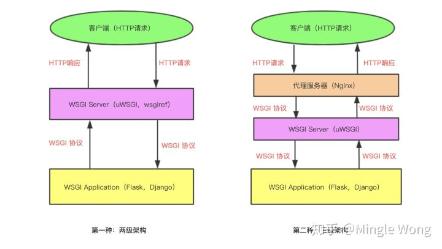

https://zhuanlan.zhihu.com/p/68676316

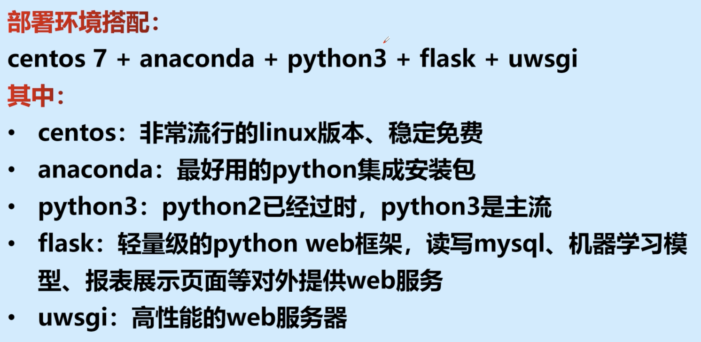

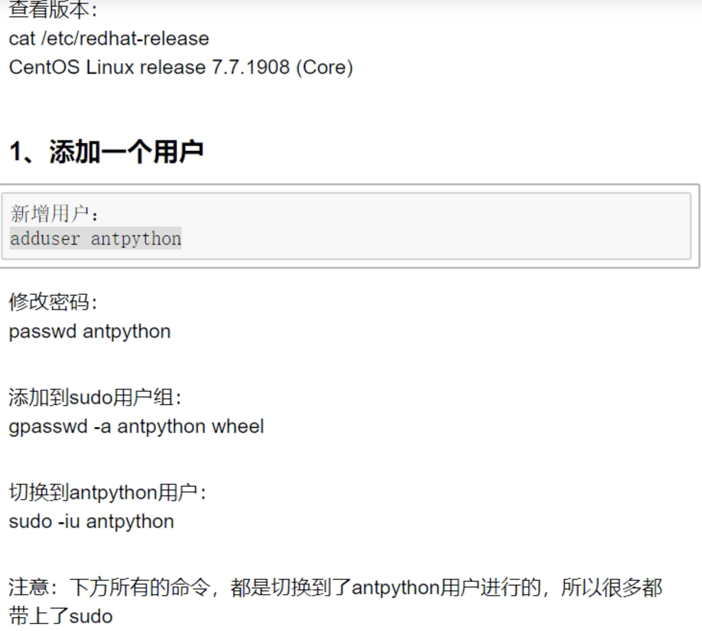

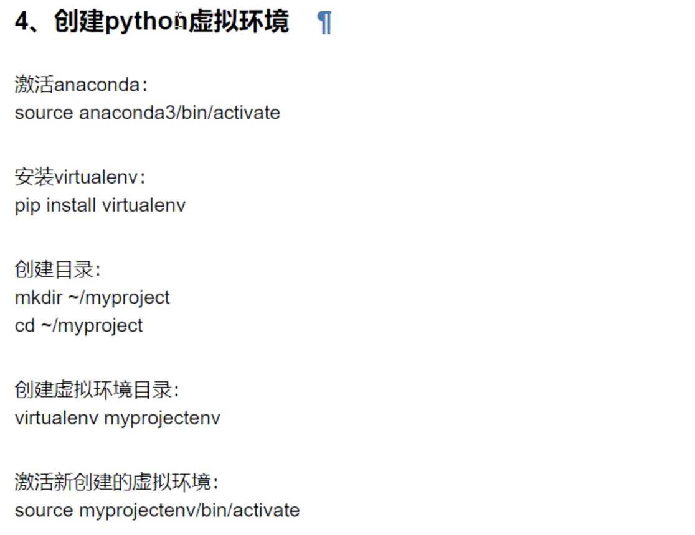

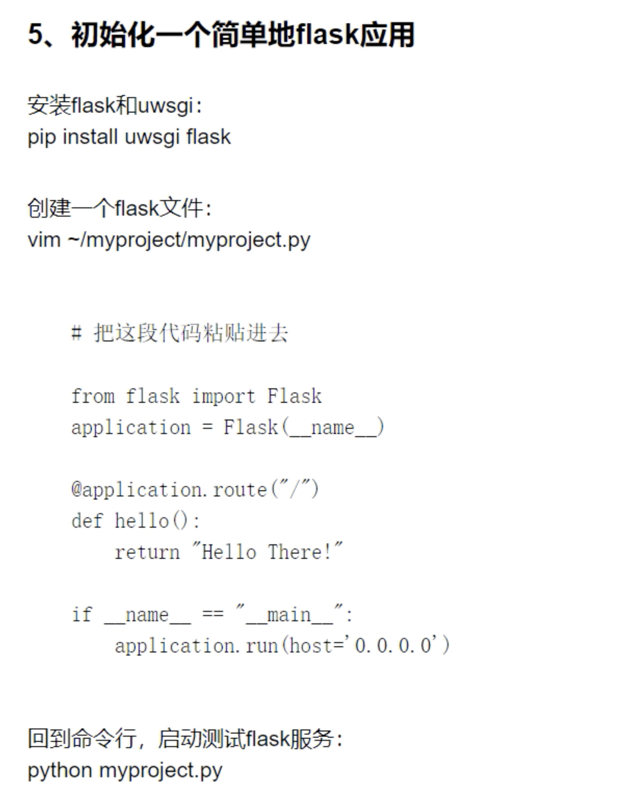

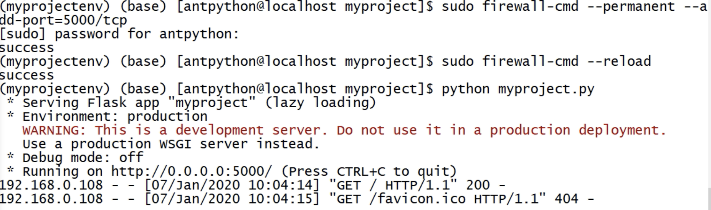

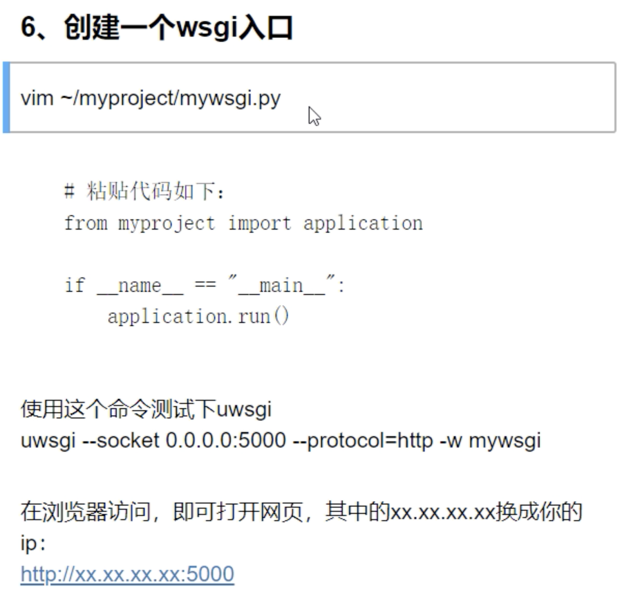

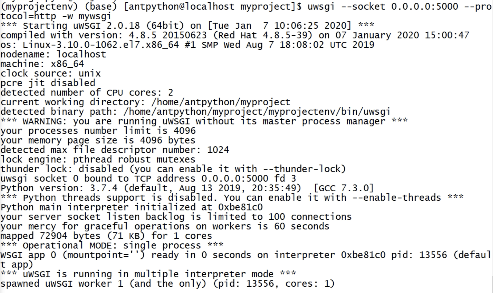

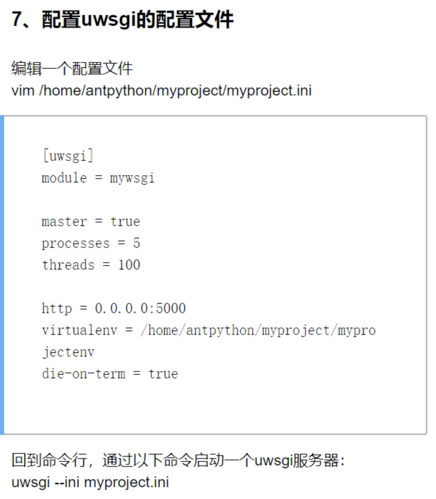

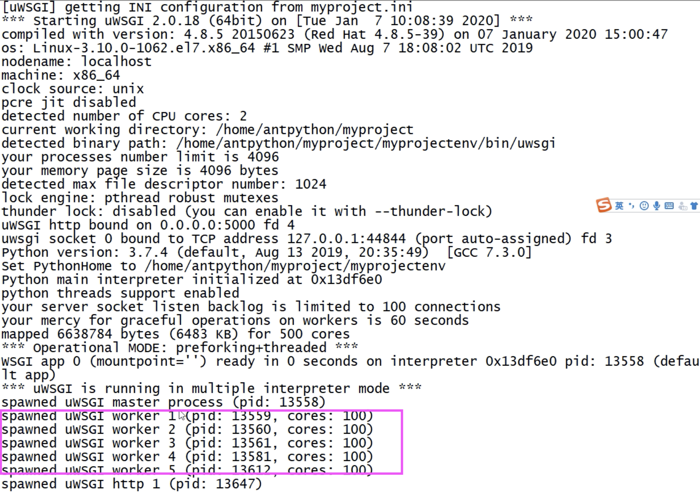

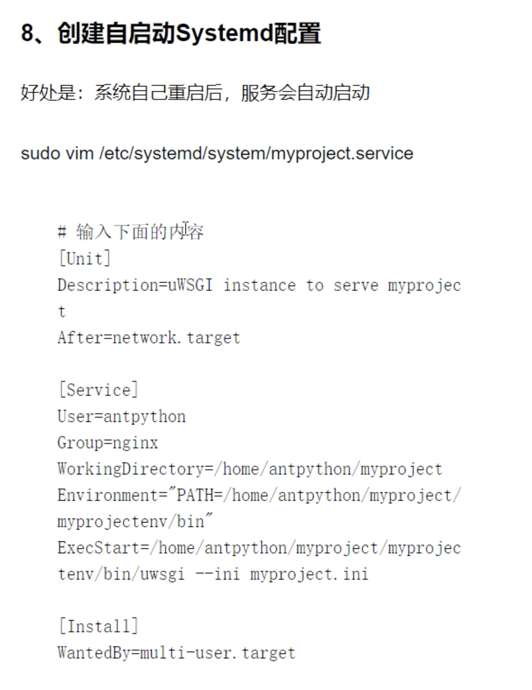

